# 👋 Hi there my name is Beksultan 

Welcome to my GitHub profile! 🚀 While I’m still on my journey of building significant achievements, I’m excited to share some of the projects I’ve worked on so far. From contributing to [kashkaldak.edu.kg](https://kashkaldak.edu.kg) and [cool.kg](https://cool.kg), to creating an [OpenGraph](https://babdikaarov.home.kg) service in Go and making small contributions to X-schedule in open source — each project has been a step forward and were built using a diverse tech stack, which you can explore [here](#my_stack). I’ve also explored various proof-of-concept as pet projects, [Hugo](https://helloitsafari.netlify.app/), [Spotify API](https://babdikaarov.netlify.app/), [React Router](https://babdikaarov1.netlify.app/), and [Redux](https://babdikaarov3.netlify.app/).💡

If you’re curious to connect or collaborate, don’t hesitate to reach out on  . 🌟

 

 

  

## 🚀 Building My Future Tech Stack: Wishlist 🚀

I’m passionate about continuously expanding my skills and exploring new technologies. Here’s a list of the languages, frameworks, and tools that I’m excited to dive into as I shape my future tech stack. Let’s connect if you’re working with any of these or have cool projects in mind!

 

<!--
**babdikaarov/babdikaarov** is a ✨ _special_ ✨ repository because its `README.md` (this file) appears on your GitHub profile.

Here are some ideas to get you started:

- 🔭 I’m currently working on ...
- 🌱 I’m currently learning ...
- 👯 I’m looking to collaborate on ...
- 🤔 I’m looking for help with ...
- 💬 Ask me about ...
- 📫 How to reach me: ...
- 😄 Pronouns: ...
- ⚡ Fun fact: ...
-->
